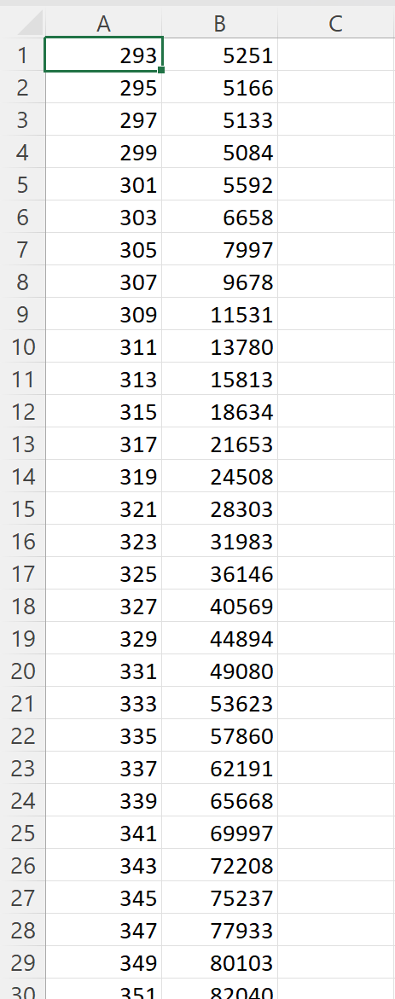

# [TL Glow Curve Deconvolution](https://tlgcdeconv.streamlit.app)

Thermoluminescence glow curve deconvolution by minimising the figure of merit using numerical methods.

## Usage

1. Open [the Streamlit app](https://tlgcdeconv.streamlit.app).
2. Upload the file containing the data (in csv format only). The data should be as shown below: no headers, the first column must contain the temperature values (in K) and the second column contains the intensitie values (in a.u.).

3. Click the "Upload" button.
4. The program attempts to identify the number of peaks, locate the maxima of the data and display them.
5. The initial values of the parameters are determined by these maxmima (as they are computed using numerical methods) and displayed in the graph below.
6. One can change the parameters provided. **It is strongly recommended to set the initial $T_m$ and $I_m$ values close to the expected maxima of the individual peaks, as this would help with convergence.** See [below](https://github.com/Vardhan-R/TL-Glow-Curve-Deconvolution?tab=readme-ov-file#choosing-the-parameters-wisely) for more information on how to choose the parameters wisely.
6. Click the "Submit" button to update the parameters.
7. Click the "Execute" button to apply the hosen numerical method and determine the final parameters.

## Choosing the Parameters, Wisely

### Number of peaks

- If the fitted curve has an unexpectedly peaks where it is not supposed to, there may be more peaks which have not been initialised.

### $T_m$

- Set each $T_m$ to the expected value of each of the peaks.

### $I_m$

- If two peaks seem have their maxima close by, then initialise to their corresponding $I_m$ values to be slightly lesser, such that the sum of the peaks would fit the data closely.

### $b$ and $E$

- Don't matter much.
- Set $b$ initially around 1.6.
- Set $E$ initially around 1.

## To Do

- Use the double derivative method to identify the peaks.
- Add an option to set the inital values of the base term parameters too.
- Add an option to export the fitted parameters.
- Better layout for the fitting part.
