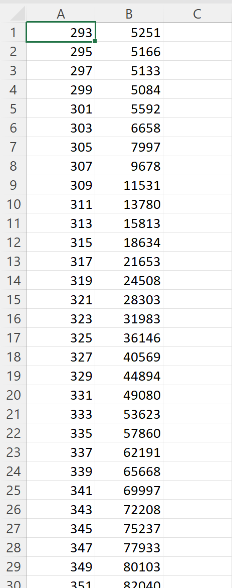
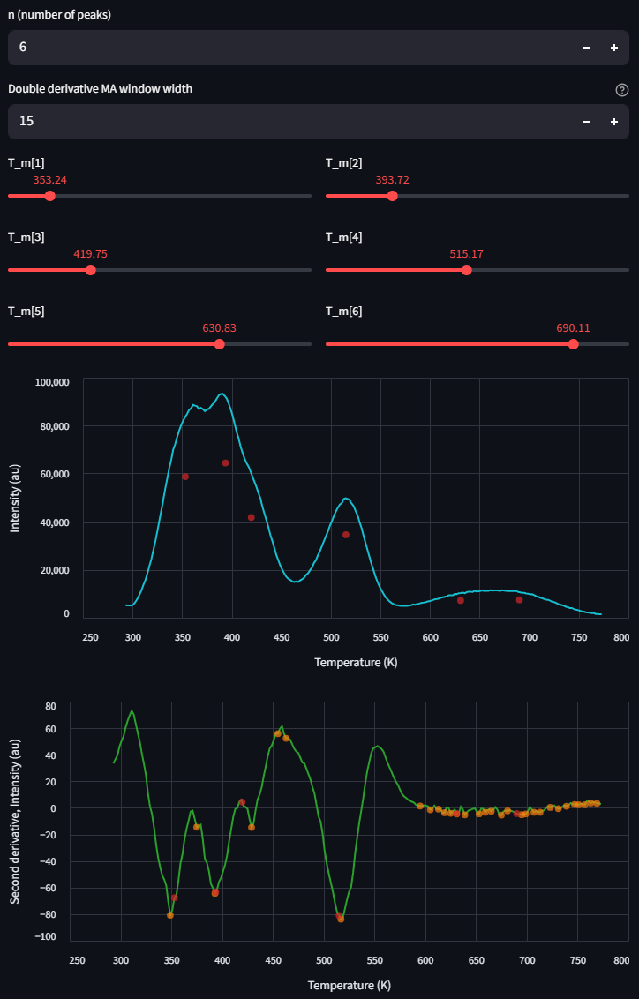
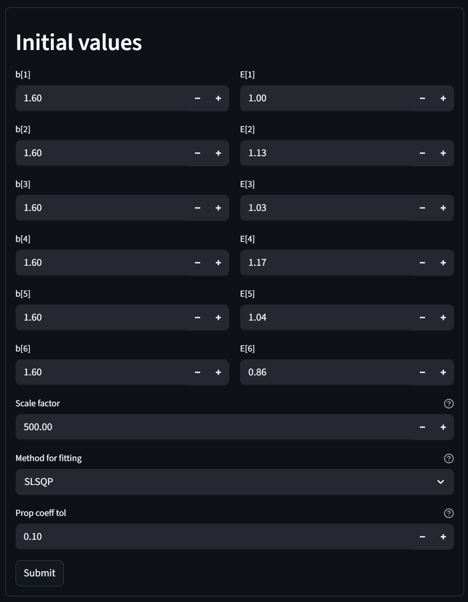
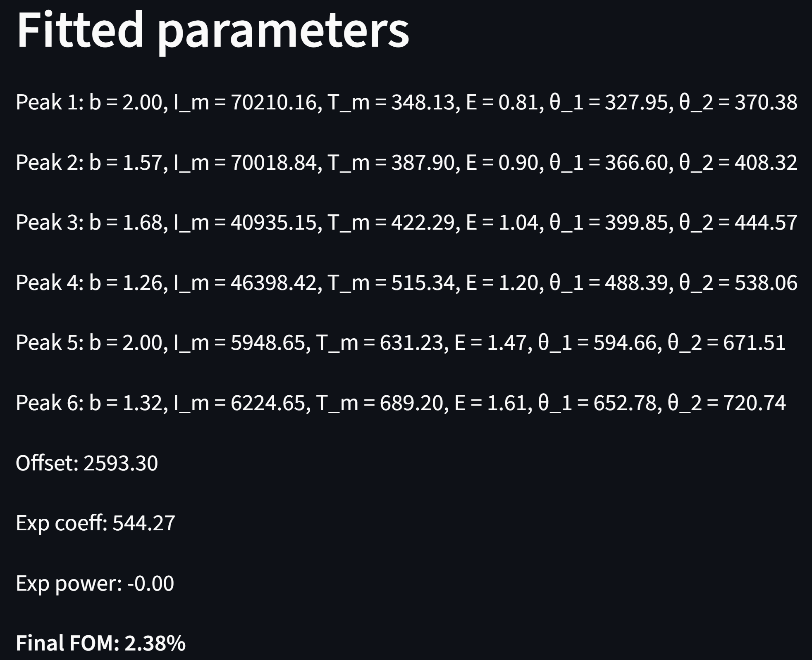
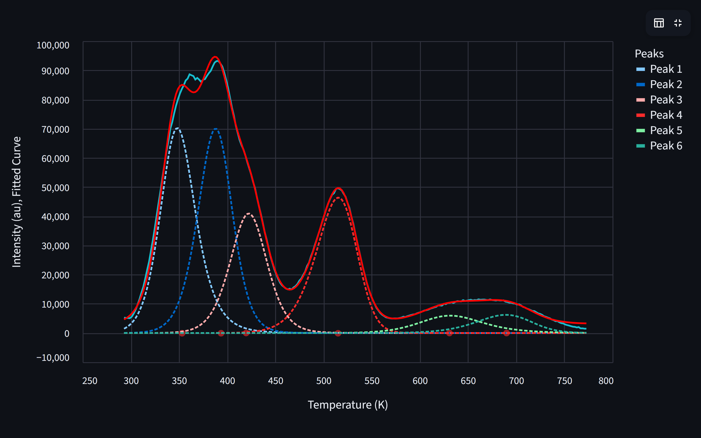

# [TL Glow Curve Deconvolution](https://tlgcdeconv.streamlit.app)

Thermoluminescence glow curve deconvolution by minimising the figure of merit using numerical methods.

## Usage

1. Open [the Streamlit app](https://tlgcdeconv.streamlit.app).
2. Upload the file containing the data (in CSV format only). The data should be as shown below: no headers, the first column must contain the temperature values (in K) and the second column contains the intensitie values (in a.u.).

3. Click the "Upload" button.
4. The program attempts to identify the number of peaks, locate the maxima of the data and display them.
5. Using the graphs below as reference, set the number of peaks, and use the sliders to set the initial $T_m$ values. The corresponding $I_m$ values are determined by the program.
6. One can change the parameters provided. **It is strongly recommended to set the initial $T_m$ values close to the expected maxima of the individual peaks, as this would help with convergence.** See [below](#choosing-the-parameters-wisely) for more information on how to choose the parameters wisely.
7. Click the "Submit" button to update the parameters.
8. Click the "Execute" button to apply the chosen numerical method and determine the parameters. The fitted parameters, final FOM, and plots are then displayed.
9. Use the "Download" button to download the fitted parameters.

## Choosing the Parameters, Wisely

### Number of peaks

- If the fitted curve has peaks where it is not expected to, there may be more peaks which have not been initialised (underfitting).

### $T_m$

- Set each $T_m$ to the expected value of each of the peaks.

### $b$ and $E$

- The initial values don't matter much.
- Set $b$ initially around $1.6$.
- Set $E$ initially around $1$.

### Scale factor

- Choose the scale factor such that the intensities, when divided by the scale factor, lie roughly in the *tens to hundreds* range.

### Method

- During testing, it was observed that `SLSQP` works best, and `COBYQA` may not work.

## Example

See the example below.

